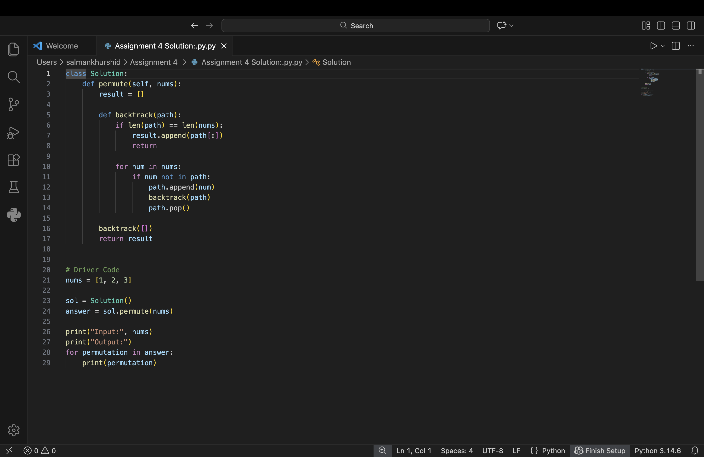

# DSA Assignment 4 - Permutations

## Problem Statement
Given an array of distinct integers, return all possible permutations.

## Language
Python 3

## Algorithm
Backtracking

## Time Complexity
O(n × n!)

## Space Complexity
O(n)

## Code Screenshot

## Output Screenshot

